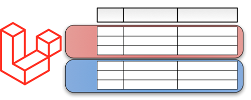
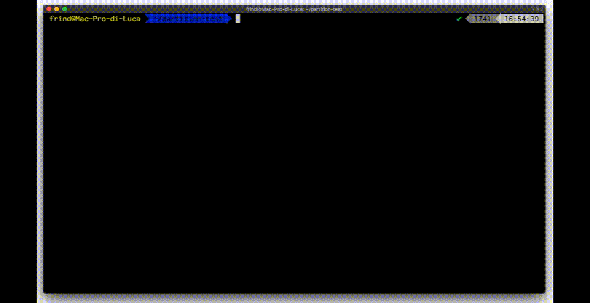

# Laravel MySQL Partition


**Laravel-mysql-partition** is a useful Laravel package to easily work with [MySQL Partition](https://dev.mysql.com/doc/refman/5.7/en/partitioning.html). please check the documentation for your MySQL version. Partitioning require a MySQL's version >= 5.1.0

<p align="center" >
  
</p>

<p align="center" >★★ <b>Star our github repository to help us!, or <a href="https://www.paypal.com/cgi-bin/webscr?cmd=_s-xclick&hosted_button_id=BZD2RPBADPA6G" target="_blank"> ☕ pay me a coffee</a></b> ★★</p>
<p align="center" >Created by <a href="http://www.lucabecchetti.com">Luca Becchetti</a></p>


## Installation
<p align="center" >
  
</p>


Add the package using composer:

```sh
$ composer require brokenice/laravel-mysql-partition
```

For Laravel versions before 5.5 or if not using auto-discovery, register the service provider in `config/app.php`:

```php
'providers' => [
  /*
   * Package Service Providers...
   */
  Brokenice\LaravelMysqlPartition\PartitionServiceProvider::class,
],
```

## Quickstart

### Create a migration

From the command line:

```shell
php artisan make:migration create_partitioned_table
```

Then edit the migration you just created by adding one of the partition schema provided by this package;

```php
use Illuminate\Database\Migrations\Migration;
use Illuminate\Database\Schema\Blueprint;
use Brokenice\LaravelMysqlPartition\Models\Partition;
use Brokenice\LaravelMysqlPartition\Schema\Schema;

class CreatePartitionedTable extends Migration {

    /**
     * Run the migrations.
     *
     * @return void
     */
    public function up()
    {
        Schema::create('partitioned', static function (Blueprint $table) {
            $table->bigInteger('id');
            $table->string('name');
            $table->date('date');
            $table->timestamps();
            $table->primary(['id','date']);
        });
        
        // Force autoincrement of one field in composite primary key
  		Schema::forceAutoIncrement('partitioned', 'id');
  		
  		// Make partition by LIST
        Schema::partitionByList('partitioned', 'id',
            [
                new Partition('server_east', Partition::LIST_TYPE, [1,43,65,12,56,73]),
                new Partition('server_west', Partition::LIST_TYPE, [534,6422,196,956,22])
            ]
        );
    }

    /**
     * Reverse the migrations.
     *
     * @return void
     */
    public function down()
    {
        Schema::drop('partitioned');
    }
}
```

Run the migration:

```shell
php artisan migrate
```

## Partitions support

Package supports these methods of partitions:

**Mysql Partition Types Supports:**

* RANGE
* LIST
* HASH
* KEY 

**Special Partition Types Supports:**

* YEARS
* YEARS AND MONTH
* MONTH (cooming soon)
* DAYS (cooming soon)

### Partition by RANGE

This type of partitioning assigns rows to partitions based on column values falling within a given range.

```
Schema::partitionByRange('partitioned', 'YEAR(date)', [
    new Partition('anno2000', Partition::RANGE_TYPE, 2000),
    new Partition('anno2001', Partition::RANGE_TYPE, 2001),
    new Partition('anno2002', Partition::RANGE_TYPE, 2002),
    new Partition('anno2003', Partition::RANGE_TYPE, 2003),
]);
```

> **Note**: Using the above code you will not be able to insert records that do not correspond to any range, for example: 2010, to do this you must specify the creation of a partition for future values, you can do so by specifying the parameter ** includeFuturePartition ** to true, as per example:


```
Schema::partitionByRange('partitioned', 'YEAR(date)', [
    new Partition('anno2000', Partition::RANGE_TYPE, 2000),
    new Partition('anno2001', Partition::RANGE_TYPE, 2001),
    new Partition('anno2002', Partition::RANGE_TYPE, 2002),
    new Partition('anno2003', Partition::RANGE_TYPE, 2003),
], true);
```

### Partition by LIST

Similar to partitioning by RANGE, except that the partition is selected based on columns matching one of a set of discrete values.

```
Schema::partitionByList('partitioned', 'id',
	[
		new Partition('server_east', Partition::LIST_TYPE, [1,43,65,12,56,73]),
		new Partition('server_west', Partition::LIST_TYPE, [534,6422,196,956,22])
	]
);
```

### Partition by HASH

With this type of partitioning, a partition is selected based on the value returned by a user-defined expression that operates on column values in rows to be inserted into the table. The function may consist of any expression valid in MySQL that yields a nonnegative integer value. An extension to this type, LINEAR HASH, is also available.

```
Schema::partitionByHash('partitioned', 'YEAR(date)', 10);
```

### Partition by KEY

This type of partitioning is similar to partitioning by HASH, except that only one or more columns to be evaluated are supplied, and the MySQL server provides its own hashing function. These columns can contain other than integer values, since the hashing function supplied by MySQL guarantees an integer result regardless of the column data type.

```
Schema::partitionByKey('partitioned', 10);
```

### Partition by YEARS

This type of partitioning allow you to partition a table for a specified years range.

```
Schema::partitionByYears('partitioned', 'date', 2000, 2010);
```

You can omit the end year of range, and current year will be used:

```
Schema::partitionByYears('partitioned', 'date', 2000);
```

### Partition by YEARS AND MONTHS

This type of partitioning allow you to partition a table for a specified years range, and sub partition each year for a month.

```
Schema::partitionByYearsAndMonths('test_part', 'date', 2019);
```

You can omit the end year of range, and current year will be used:

## Composite primary key

To partition a table, columns must be an index, if you want to use a different column from **id** you have to change this line of you migration file:


```
$table->bigIncrements('id');
```

to this, creating a composite primary key

```
$table->bigInteger('id');
$table->primary(['id','date']);
```

> **Note**: Using the above code you'll lose the autoincrement for id field, you can force it before run partition, if you need, with this code:

```
Schema::forceAutoIncrement('partitioned', 'id');
```

## Querying parition with Eloquent

Using this package you can query an individual partition, or multiple partitions, directly from eloquent model:

### Create a model
```shell
php artisan make:model Partitioned
```

Then edit the model you just created:

```php
namespace App;

use Illuminate\Database\Eloquent\Model;

class Partitioned extends Model
{
    protected $table = 'partitioned';
}
```

### Query to a single partition

```php
Psy Shell v0.9.9 (PHP 7.3.6 — cli) by Justin Hileman
>>> use App\Partitioned;
>>> Partitioned::partition('name')->first();
```

### Query to a multiple partition

```php
Psy Shell v0.9.9 (PHP 7.3.6 — cli) by Justin Hileman
>>> use App\Partitioned;
>>> Partitioned::partitions(['name', 'name1'])->first();
```

## Artisan command

This package comes with a useful set of artisan command:

```php
php artisan laravel-mysql-partition
            {action : Action to perform} 
            {--table=} {--method=} {--number=} {--excludeFuture} {--column=} {--partitions=*}
```

### Available commands

| Action                             | Description                                                |
| ------------------------------------------------------------ | ------------------------------------------------------------ |
| `list`      |  Returns list of partition names for a specific table   
| `create`    |  Create partition on exisiting table
| `delete`    |  Delete existing partition  
| `truncate`  |  Truncate existing partition    
| `optimize`  |  Optimize existing partition     
| `repair` 	 |	Repair existing partition  
| `check`     |  Check existing partition       
| `analyze`   |  Analyze existing partition        
| `rebuild`   | Rebuild existing partition  

Form detail infomration on actions, refere to : [this link](https://dev.mysql.com/doc/refman/5.7/en/partitioning-maintenance.html).


## Tests

```shell
$ composer test
# or 
$ composer test:unit
```

### Comming soon

```shell
$ composer test:integration
```

Integration tests will require a running MySQL database. If you have Docker installed, you can start easily start one:

```shell
$ make start_db		# starts MySQL 8.0
# or
$ make start_db V=5.7	# starts MySQL 5.7
```

## Contributing

Recommendations and pull request are most welcome! Pull requests with tests are the best!. 


### Are you using this package?
I'm interested in making a list of all projects which use this library. Feel free to open an Issue on GitHub with the name and links of your project; we'll add it to this site.

## Credits & License
larave-mysql-partition is owned and maintained by [Luca Becchetti](http://www.lucabecchetti.com) 

As open source creation any help is welcome!

The code of this library is licensed under MIT License; you can use it in commercial products without any limitation.

The only requirement is to add a line in your Credits/About section with the text below:

```
Partition by laravel-mysql-partition - http://www.lucabecchetti.com
Created by Becchetti Luca and licensed under MIT License.
```
## About me

I am a professional programmer with a background in software design and development, currenlty i am a leader of "Brokenice" that provides high-performing, on-demand teams of developers for leading brands.

In the last years, I developed my qualitative skills on a startup company named "Frind" as Project Manager and ios senior software engineer, we had worked on a new social network application, it includes chat system based on XMPP Framework and Ejabberd server.

I'm high skilled in Software Design, i have been worked since i was young as webmaster, and i'm a senior Php developer. In the last years i have been worked hard with mobile application programming, Swift for ios world, and Java for Android world.

I'm an expert mobile developer and architect with several years of experience of team managing, design and development on all the major mobile platforms: iOS, Android (3+ years of experience).

I'm also has broad experience on Web design and development both on client and server side and API /Networking design. 

All my last works are hosted on AWS Amazon cloud or Google Cloud Platform, i'm able to configure a network, with Unix servers. For my last works i configured apache2, ssl, ejabberd in cluster mode, Api servers with load balancer, and more.

When i was eleven, i created a CMS in ASP called openasp, it has been used for more years in more than 10.000 websites. The project has been closed when ASP has been deprecated, and i started to learn PHP.

I live in Assisi (Perugia), a small town in Italy, for any question, [contact me](mailto:luca.becchetti@brokenice.it)


